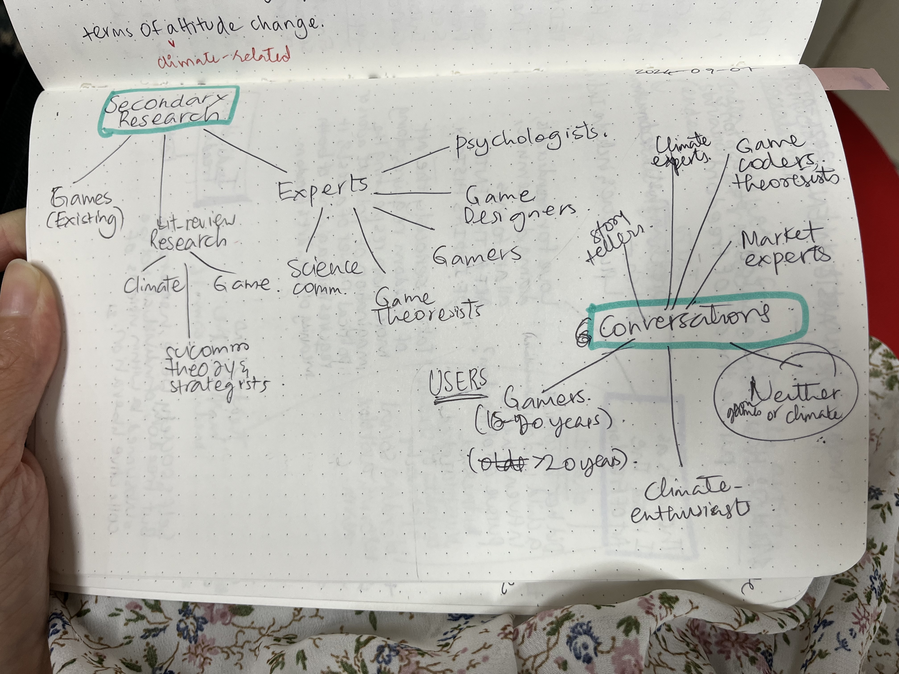

- Approach the ELM Team for clarifications about doubts, NDA, project requirements, any other needs.
- Establish group norms–
   - Working strengths and shortcomings, apprehensions, working styles (Spreadsheet?)
⁠    - Communication channel– Discord
- Refine SMART Problem Statement - final 
- Narrow down secondary research themes, topics– 
- Gaming, Climate Change and its history, mitigation, adaptation, Decision science, CC communication science, storytelling

### Notes:
- 50-50 Story and final decision
- Reaching out to experts and YIF fellows in storytelling, climate science, sociology. Faculty for climate fiction. 
- Finalizing on game content– number of scenarios, time spent, weight given to decisions - maybe consult a game expert on this before we start?
- Come up with a decision process for the team– core values that need to be kept in mind in context of the broader game. 
- Remember to have fun! 
- Under promise, overdeliver
Completed discord primer, problem statement, discussed secondary research themes

### Conclusion: 

#### Secondary research: 
- Tanvi Saxena to create document CC history– mitigation, policy
- Abhishek Panchal Abhishek : gaming 
- Anushka Barthwal: decision science 
- Shweata Hegde: Theory of climate science communication _ gaming and cc comm. 
### Next meeting: 
Contact Memesys, Shreshth (?), Climate Fiction faculty (Alex?)
Joining Gaming Society
Website – condense info up until now. 
Aesthetics of the game
