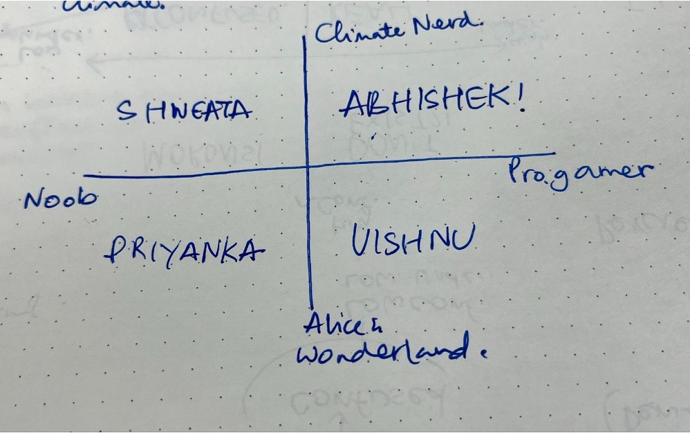

Started at 12.00

In this meeting we made a list of people to reach out to and have indepth conversations with. 
### List of people to reach out and who will they be talking to:

-- Kallol - Shweata
-- Ashritha – Game, Storytelling - Shweata
-- Chandan - Abhishek
-- Priyanka – Neither people - Tanvi
-- Heer – Storytelling - Tanvi
-- Arushi – Design gen - Abhishek
-- Serene – Anushka
-- Sohan – Storytelling - Anushka
-- Helena – Climate - Abhishek
-- Enya – Science - Abhishek
-- Prarthana - Shweata
-- Rutuja – Comms Sustainability - Anushka
-- Prachi - Shweata 
-- Pushpendra – Sustainability - Anushka
-- Ashay - Tanvi
-- Srikant - Tanvi  

### Experts
-- Sayan from Critical Writing Program
-- Priyank from Center for Entreprenaurship

### Notes:

-- Memesys message – “Please shoot us an email with as much detail as you have about this game - a design note about the game, what the ambition is, what the mechanics are, how you plan to develop it. That'll give us a good sense of things, and something to respond to. here's zain and my email IDs:
#### Things to ask: 

-- Record and Transcribe, ask permission.

##### Forest people: 
-- Talk about climate – what do you think CC is? Personal experience? Nudge more info out. (figure out baseline of understanding, can be a gap through which we approach our scenarios)
Level of confidence - the degree of certainty or conviction of your belief. How you sound, emotionality. How ready you are to recognise that you may not know the most.  Level of understanding 
-- If good enough understanding - How did you first come across the issue of cc? When,where, how, why? What did it make you think/feel? What is your relationship with cc now - how and why do you engage with it? To what extent and how often? What do you think about a climate change game, regardless of whether you would play it or no? What do you think we should absolutely do in this game? ask Qs about awareness, how they reached their current understanding, ways in which game should approach decisions, if you were a player what would you like most
-- If not good enough understanding - (may be confused or disengaged) do you believe in CC? Do you ever engage with climate news/information? If yes, how/when/why? What does it make you think/feel?If no, why? What does it make you think/feel? 

##### Incel Basement Dwellers:
-- Description of game – what do you think? 
-- If gamer– Would you pick this game - why? What would make you pick this game up? Ways to make it a fun game to play? What do you like in a game? 
-- If nongamer– what kind of games have you played? Core memory associated with the game? Have you had fights when playing, and why? What would make you pick this game? 

##### Wannabe Anurag Kashyaps:
-- What are your favorite stories/movies/books/etc
-- If storytellers - how do you construct a compelling story? What makes people vibe? what aspects of the medium should we focus on? Is there a template for storylines or storytelling? 
-- If not storytellers - have there been stories you’ve liked? What was the most memorable part of it? What is it about a particular media that makes you decide you want to check it out?

### Deadline: 
18th (wednesday) - meeting for aesthetics of game
19th (thursday) - lit review
20th (friday) - discuss lit review + OH with elm team
 
### Next meeting: 
Core framework of game - need to establish → design note for memesys
Aesthetics of game → logo, landing page, fonts, start of game, design note. 
Mood board for each of us - what vibez we imagine (ss, games, clips, etc)
