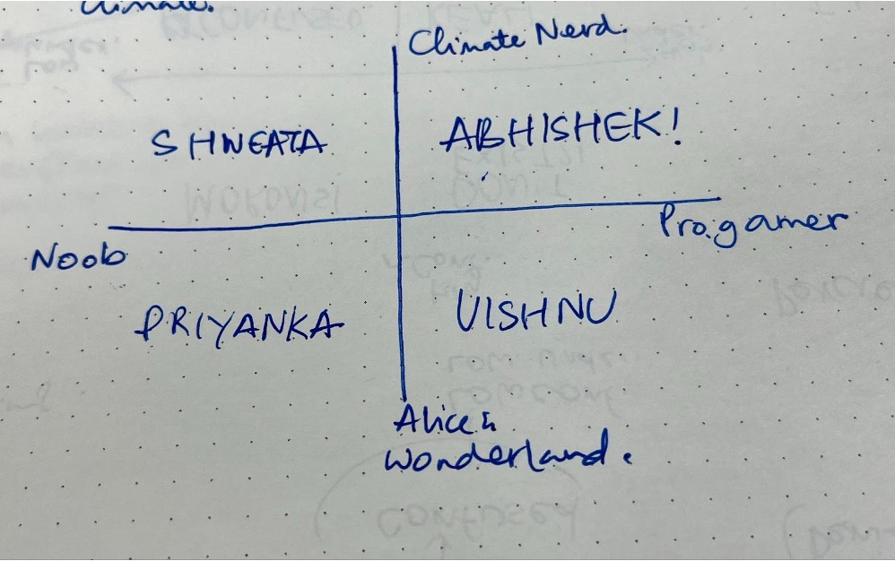

# Survey Insights

### Demographics

- As of time of summarisation, 173 responses
- 86.71% responses from 16-30 years
- 50% women, 42% men, 4% non-binary
- 49.71% with Bachelor's degree; 29.48% with Masters
- Annual HHI– 31% over 20 lakhs, 26% between 12-20 lakhs, 20% between 8-12 lakhs, 23% less than 8 lakhs

### Do you think climate change is happening?

- 99% Yes, 1% No

### Surety in climate change?

- Scored from 1-4 on how sure (1 being 'little sure' and 4 being 'extremely sure')
- Average rating – 3.82 
    - 84% extremely sure
    - 15% quite sure
    - 1% somewhat sure

### How serious is climate change as a problem?

- Scored from 1-4 on how serious (1 being 'not a problem' and 4 being 'very serious problem')
- Average rating – 3.85 
    - 86.7% very serious
    - 12.1% sort of serious
    - 1.2% not too serious

 ### Knowledge about climate change?

- Scored from 1-5 on how much knowledge (1 being 'no knowledge' and 5 being 'expert')
- Average rating – 3.49 
    - 52% have studied effects of CC
    - 38% have some information
    - 7% have very limited knowledge
    - 3% expert on CC
 
 ### Cause of climate change?

- 92% believe caused by human activies
- 6% unsure
- 2% believe caused by natural environment and other factors

## Expected impacts of climate change?

– Scored from 1-5 on likelihood (1 as low and 5 as high)

### Increased temperatures globally

– Average rating – 4.84

### Decreased temperatures globally

– Average rating – 3.09

### Increased potable water

– Average rating – 2.37

### Decreased potable water

– Average rating – 4.15

### Increased heat waves

– Average rating – 4.77

### Increased rates of species extinction

– Average rating – 4.63

### Decreased food production globally

– Average rating – 3.99

### Increased sea levels

– Average rating – 4.59

### Increased intensity of regional storms

– Average rating – 4.40

### No change beyond natural variability

– Average rating – 2.19

## User Personas

Before conducting the in-depth interviews, we made the following categories:
1. Pro-gamers; active climate-engagers
2. Noob-gamers; active climate-engagers
3. Pro-gamers; casuallly climate-interested 
4. Noob-gamers; casually climate-interested

Through our conversations, we found people who fell under 2., 3., and 4. Through our game, we would like to target 2. and 3. user personas.

Since the survey was to get baseline understanding about people's climate knoweldge, the data was not suitable to be used to build our user personas. 

## User Personas

Before conducting the in-depth interviews, we made the following categories:
1. Pro-gamers; active climate-engagers
2. Noob-gamers; active climate-engagers
3. Pro-gamers; casuallly climate-interested 
4. Noob-gamers; casually climate-interested

Through our conversations, we found people who fell under 2., 3., and 4. Through our game, we would like to target 2. and 3. user personas.

Since the survey was to get baseline understanding about people's climate knoweldge, the data was not suitable to be used to build our user personas. 

