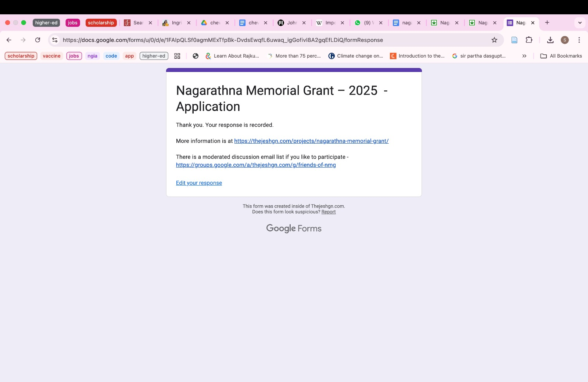

The past month has been filled with lots of work, fun and stress for Team Pralay. So much so that we were not able to keep track of all of what we did. This is going to be an honest attempt at bringing the tracking journal upto speed.

As laid out before, our work was divided into the following categories: 
1. Game Mechanics (Jalwa index, Khayal index, voting, chaos odds, faction advantages)
2. Design (board, token, box)
3. Content (dilemma cards, character cards, rulebook)
4. Marketting (website, social media)
5. Misc (Pitch decks, pitch videos, kickstarters)

## First week of March
We made our first ever 90 second pitch video. Woke up at 0700 in the morning, recorded and edited in few hours (special kudos to Anushka :P).

Over the weekend, we also got our website up and running. So, yay :) Go check out www.pralaythegame.com. 

_Screenshot of the website_

We also discussed design ideas, colours, pouches for tokens, and the number and denominations for tokens.

_Quick plotting for Token calculation_

## Second week of March

Given some intense work on design, some team members felt burnt out. However, we continued working on content and picking out colours. Amidst all the board game work, we managed to write and submit an application for a micro-grant called Nagaratna Memorial Grant. Fingers crossed that we get it :)


    
    


## Third Week of March
Elements of the game were starting to come together, but we had to continue to keep at it. We designed our token and sent it off to Tanvi's cousin who makes stuff from waste wood. We finally finalised colours. Once we had the colours, Abhishek and Tanvi got started on the board design.

Anushka and Shweata created a database to manage dilemma cards.


    
    
    
    


Our team also enjoyed Indian Ocean's concert that week :P

## Fourth Week of March
Anushka and Abhishek visited a Printers shop to negotiate prices, check out the quality and types of cardboard and paper for our game elements. I wish there were videos/images I could attach here. But it turns out that those two were so excited that they only managed to capture a video of their metro arriving.

We also managed to continue working on game design and dilemma cards. Abhishek and Tanvi were busy going back and forth on the minutest details of the board whereas Anushka and Shweata banded together to assign metrics for dilemma cards.